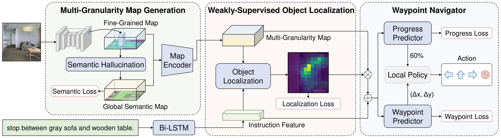

# [NeurIPS 2022] WS-MGMap for VLN
Official Pytorch implementation for NeurIPS 2022 paper "Weakly-Supervised Multi-Granularity Map Learning for Vision-and-Language Navigation”




## Setup
This code is developed with Python 3.6, PyTorch 1.6.0. Please follow [VLN-CE](https://github.com/jacobkrantz/VLN-CE) to install Habitat-Sim and Habitat-Lab. Then clone this repository and install requirements.

```bash
git clone git@github.com:PeihaoChen/WS-MGMap.git
cd WS-MGMap
pip install -r requirements.txt
```


## Data

### Download Scenes and Episodes
Follow the instructions in [VLN-CE](https://github.com/jacobkrantz/VLN-CE) to download Matterport3D scenes to `data/scene_datasets` folder and VLN-CE datasets to `data/datasets` folder  and corresponding episodes data.

### Download Ground-Truth Semantic Map
Download the cache ground-truth semantic map [here](https://drive.google.com/file/d/1pJwx0E95WsJXThcx8tPrUTB_6gTlryoy/view?usp=share_link) to `data/map_data` folder as the supervision for the semantic hallucination.

### Download Pre-Trained Model
The pre-trained semantic segmentation model for the semantic segmentation and DD-PPO model for the navigation control can be found [here](https://drive.google.com/file/d/1h7va7waqruCrAxppX4VDhw8mkxfqU1_q/view?usp=share_link). Download it to `data/pretrain_model` folder

### Data Format
This code expects all data files in the following structure:

```graphql
WS-MGMap
├─ data
|   ├─ datasets
|   |    ├─ R2R_VLNCE_v1-2
|   |    ├─ R2R_VLNCE_v1-2_preprocessed
|   ├─ map_data
|   |    ├─ semantic
|   |    |    ├─ train
|   |    |    |    ├─ ep_0.npy
|   |    |    |    ├─ ...
|   |    |    ├─ train_aug
|   |    |    |    ├─ ep_0.npy
|   |    |    |    ├─ ...
|   ├─ pretrain_model
|   |    ├─ ddppo-models
|   |    |    ├─ gibson-2plus-resnet50.pth
|   |    ├─ unet-models
|   |    |    ├─ 2021_02_14-23_42_50.pt
|   ├─ scene_datasets
|   |    ├─ mp3d
|   |    |    ├─ 1LXtFkjw3qL
|   |    |    ├─ ...
```


## Usage

### Evaluation
We provide our trained models [here](https://drive.google.com/file/d/1HcD8s-tyBeH2LsXs6Rj5x5DC1hVD4GNs/view?usp=share_link) for reproducing the results shown in the paper.
Run the following to evaluate a trained model:

```bash
export CUDA_VISIBLE_DEVICES=0
python -m torch.distributed.launch --nproc_per_node=1 run.py \
--run-type eval \
-c vlnce_baselines/config/CMA_AUG_DA_TUNE.yaml \
-e $PATH_TO_SAVE_RESULT$ \
EVAL_CKPT_PATH_DIR $PATH_TO_TRAINED_MODEL$ \
NUM_PROCESSES 1 \
use_ddppo True
```


### Training
STAGE1: Run the following for teacher forcing training on augmented data:

```bash
export CUDA_VISIBLE_DEVICES=0,1,2
python -m torch.distributed.launch --nproc_per_node=3 run.py \
-c vlnce_baselines/config/CMA_AUG.yaml \
-e $PATH_TO_SAVE_RESULT$ \
NUM_PROCESSES 6 \
DAGGER.BATCH_SIZE 8
```

STAGE2: Run the following for dagger training to fine-tune the model:

```bash
export CUDA_VISIBLE_DEVICES=0,1,2
python -m torch.distributed.launch --nproc_per_node=3 run.py \
-c vlnce_baselines/config/CMA_AUG_DA_TUNE.yaml \
-e $PATH_TO_SAVE_RESULT$ \
NUM_PROCESSES 5 \
DAGGER.BATCH_SIZE 8 \
DAGGER.CKPT_TO_LOAD $PATH_TO_MODEL_FROM_STAGE1$
```


## Citation
If you use or discuss WS-MGMap in your research, please consider citing the paper as follows
```
@article{chen2022weakly,
  title={Weakly-supervised multi-granularity map learning for vision-and-language navigation},
  author={Chen, Peihao and Ji, Dongyu and Lin, Kunyang and Zeng, Runhao and Li, Thomas H and Tan, Mingkui and Gan, Chuang},
  journal={arXiv preprint arXiv:2210.07506},
  year={2022}
}
```
